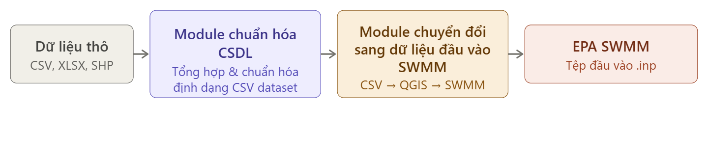

# Report: Module for Converting Digitized Wastewater System Data into Input Data for EPA SWMM Hydraulic Simulation

## 1. Overview

### 1.1 Data Conversion Process

The overall data flow consists of three main stages:



**Step 1 - Database Standardization Module**: Raw datasets from government databases are standardized. This process involves aggregating raw data into standardized information fields in CSV datasets for each component, converting data formats, and transforming coordinate systems from VN2000/UTM to WGS84.

**Step 2 - Module for Converting to SWMM Input Data**: The CSV dataset is converted directly to build data layers in QGIS memory with a field schema dedicated to SWMM. It applies spatial filtering, deduplicates junction points based on coordinates, and exports the results in EPA SWMM .inp text format through the QGIS generate_swmm_inp plugin.

### 1.2 Data Groups Requiring Conversion

Input data for hydraulic modeling is organized into 5 main groups:

| **Data Group** | **Specific Data** | **Format/Structure** | **Notes/Explanation** |
|---|---|---|---|
| **1. Topography & Spatial** | **Digital Elevation Model (DEM/LiDAR)** high resolution (minimum 5m, ideally 1m). | Raster (GeoTIFF, .asc) | Determines surface flow direction, flooding areas. |
| | **Topographic map** (contour lines, elevation points). | Vector (Shapefile, .dwg, .dxf) | Supplementary to DEM, especially in urban areas. |
| | **Land use map / Land cover layer.** | Vector/Raster (Shapefile) | Determines Manning's coefficient, permeability. |
| **2. River, Lake, canal Network** | River, canal, ditch network (centerline, cross-section, bed elevation, banks) | Vector (Shapefile, .dwg) + attributes | Foundation data for open canal flow |
| | Lakes, retention ponds, reservoirs (bed elevation, water level, capacity) | Vector + attributes | Flow regulation and water storage |
| **3. Urban Wastewater System** | **Pipe network** (location, length, diameter, slope, bed elevation, flow direction) | Vector line format (Shapefile, .dwg) | Must verify connectivity & hydraulic consistency |
| | **Manholes, flow division chambers** (location, elevation, size) | Vector point format (Shapefile) | Connect surface water and underground system |
| | **Pumping stations** (location, capacity, operation) | Vector point format (Shapefile) | Control flow in pipe network |
| | **Outfalls** (location, elevation) | Vector point format (Shapefile) | Discharge points to receiving water bodies |
| | **Weirs, pipe culverts, hydraulic structures** (size, crest elevation, operation) | Vector + detailed attributes | Control flow and water level |
| **4. Hydrology, Meteorology & Boundary** | **Rainfall time series** (per minute, hour from automated rain stations). | Table (.csv, .xlsx) by time | Primary input factor for rainfall-induced flooding model. |
| | **Water level and discharge at river boundaries** (hourly/daily). | Table (.csv, .xlsx) | Create lower and upper boundary conditions for model. |
| | **Evaporation, temperature, humidity** (for distributed hydrology model). | Table (.csv, .xlsx) | For rainfall-runoff distributed models. |
| **5. Discharge Sources** | **Location and discharge rate of discharge sources** (industrial zones, craft villages, residential areas). | Vector point (.shp) with data table | Important when expanding hydraulic model to water quality simulation. |
| | **Concentration of pollutants in wastewater** (COD, BOD, TSS, N, P...). | Table (.csv, .xlsx) | Input for water quality model. |

### 1.3 Test Network

{width="3.1093755468066493in"
height="3.220662729658793in"}
{width="3.197070209973753in"
height="3.218930446194226in"}

*Figure 1: Visual representation of the digitized wastewater network, including underground pipe sections, canal networks, rivers, manholes, pumping stations, and hydraulic structures (left)*

*Figure 2: EPA SWMM hydraulic model after conversion (right)*

## 2. Database Standardization Module

### 2.1 Purpose

The standardization module serves as the **data standardization layer** of the process. Its main objectives are:

1. **Unify Schema**: Raw data from multiple agencies use inconsistent column names (e.g., TenCongDap, TenKenhMuong, Name1), different data types and structures. This module standardizes them into a set of CSV datasets with English-language information fields, with field name length limited to 10 characters (required by ESRI Shapefile DBF format).

2. **Unify Coordinate System**: Input data uses multiple coordinate systems - Lat/Lon columns (WGS84), GeoJSON-shaped Shape columns (WGS84), and ToaDoX/ToaDoY columns in VN2000/UTM standard. This module converts all to **EPSG:4326 (WGS84)** standard.

3. **Standardize Character Encoding**: Raw datasets use different character encodings - latin-1 for Ho Chi Minh City data, utf-8-sig for Mekong Delta data. The module automatically detects encoding and outputs standard UTF-8 with .cpg files.

4. **Format Conversion**: Standardized CSV files are converted to ESRI Shapefile format with appropriate geometry (Point, LineString, Polygon), allowing QGIS Desktop to be used for visual inspection, manual editing, and QA before importing into SWMM.

### 2.2 Standardized Dataset Structure

Each standardized CSV dataset follows a unified structure:

```
dataset/
├── dia_hinh_khong_gian/ # Group 1: Topography / Spatial
│ ├── dem/
│ └── subcatchments.csv
│
├── mang_luoi_song_ho_kenh_muong/ # Group 2: River, Lake, canal Network
│ ├── rivers.csv
│ ├── canals.csv
│ ├── lakes.csv
│ └── dams.csv
│
├── thoat_nuoc/ # Group 3: Urban Wastewater System
│ ├── sewers.csv
│ ├── manholes.csv
│ ├── pumps.csv
│ ├── weir.csv
│ ├── orifices.csv
│ └── outfalls.csv
│
├── thuy_van/ # Group 4: Hydrology / Meteorology
│ └── raingages.csv
│
└── nguon_thai/
└── discharge.csv # Group 5: Discharge Sources (Point)
```

**Common conventions applied:**

- **Coordinate System (CRS)**: EPSG:4326 (WGS84) for all spatial data.

- **Field Names**: English, maximum 10 characters.

- **Geometry**: GeoJSON string in Shape or RouteShape column.

- **Metadata**: ID, Name, Location, Province, District, Ward, Manager, YearBuilt, YearUpdate, Status, and Notes.

### 2.3 Reference Databases

The standardization schema is designed based on urban infrastructure databases in Vietnam:

| **Database** | **Managing Agency** | **URL** | **Description** |
|---|---|---|---|
| **Hanoi Water Drainage System Database** | Hanoi Department of Construction | [trungtamqlhtkthanoi.vn](https://trungtamqlhtkthanoi.vn/) | System for managing Hanoi's water drainage network infrastructure. Used as reference material to define fields, component classification, and administrative data fields. |
| **Ho Chi Minh City Water Resources Infrastructure Data** | Ho Chi Minh City Department of Agriculture & Rural Development | [opendata.hochiminhcity.gov.vn](https://opendata.hochiminhcity.gov.vn/dataset) | Open data portal providing datasets on hydraulic structures (canals, dams, pumping stations, tidal barriers). This is the primary raw CSV data source for this project. |

### 2.4 Standardized Information Fields

The table below summarizes the main standardized fields for each component (in addition to common metadata fields mentioned above).

| **Component** | **Geometry** | **Main Information Fields** |
|---|---|---|
| **Catchment (Subcatchments)** | Polygon | RainGage, OutletLon, OutletLat, SewerRoute, Area_ha, Imperv_pct, Width_m, Slope_pct, N_Imperv, N_Perv, S_Imperv_mm, S_Perv_mm, PctZero, RouteTo, InfMethod, SuctHead_mm, Conductiv_mmh, InitDef, Shape |
| **Rivers** | LineString | Code, Strahler, Length_m, Width_m, BedElev_m, BankElev_m, FlowDir, FromNode, ToNode, RouteShape, XSType, Material, Basin, IrrigSys |
| **canals / Ditches** | LineString | Type, Length_m, Width_m, BedElev_m, LeftBank, RightBank, SlopCoef, Material, Grade, Purpose, SvcArea, IrrigSys, FlowDir, FromNode, ToNode, RouteShape, XSType, WtrLevel, XSArea |
| **Lakes / Retention Ponds** | Point | Group, Area_ha, BedArea_ha, Vol_m3, BedElev_m, CrestElv, BankElev_m, NatWtrLvl, WetLvl_m, DryLvl_m, NumInlets, Perim_m, IrrigSys, Shape |
| **Pipe Conduits** | LineString | Type, Diam_mm, Size_mm, Length_m, Material, XSArea, FlowDir, FromNode, ToNode, RouteShape, XSType, StreetID, DrainZone, Catchment |
| **Manholes** | Point | Type, Area_m2, Size_m, CoverType, InvElev_m, RimElev_m, SewerLine, StreetID, DrainZone, Catchment, Shape |
| **Pumping Stations** | Point | Source, SewerLine, Type, Grade, NumPumps, Cap_m3s, InElev_m, OutElev_m, AutoMonit, TrashScr, Purpose, SvcArea, IrrigSys, Shape |
| **Weirs / Culverts** | Point | Type, Form, Chainage, River, Basin, Length_m, Width_m, Height_m, Diam_m, Openings, InvElev_m, CrestElv, Grade, Operation, Purpose, Receiver, Project, SvcArea, IrrigSys, Shape |
| **Orifices** | Point | FromNode, ToNode, Position, Type, Form, Length_m, Width_m, Height_m, Openings, InvElev_m, CrestElv, DischCoef, ClearSpan, SillElev, GateMtrl, GateCtrl, Purpose, Receiver, SvcArea, Shape |
| **Outfalls** | Point | Type, Elev_m, FixedStage, FlapGate, Receiver, SewerLine, Shape |
| **Discharge Sources** | Point | Discharger, Address, Industry, Receiver, DischPt, IrrigSys, Treatment, Permit, PermitOrg, Standard, FlowRate, ExpiryDt, DischTerm, Shape |

## 3. Module for Converting to SWMM Input Data

### 3.1 Purpose

The conversion module is responsible for converting the standardized CSV datasets into EPA SWMM .inp input files. Main functions:

1. **Build SWMM Network Structure**:

    - Create a valid node-link network where nodes (manholes, outfalls, storage) are connected by links (pipes, pumps, orifices, weirs).

    - Transform canal and river paths into networks of junction points and successive pipes. Each vertex becomes a junction and each segment becomes a conduit.

    - Establish connections between components - for example: match pumping stations to lakes, link orifices to junctions on canals, insert weirs into canal segments, and replace canal endpoints with outfall nodes.

2. **Parameter Mapping**: Translate infrastructure data fields (size, elevation, material) into SWMM simulation parameters (Manning's roughness coefficient, cross-section shape, hydraulic depth).

3. **Elevation Refinement**: Use DEM raster data to calibrate node elevations (Elevation = DEM surface − Maximum depth for junction/storage; Elevation = DEM surface for outfalls).

4. **Area Extraction**: Support spatial filtering (bounding-box) to extract small models (Hanoi, Ho Chi Minh City) from national-scale datasets.

### 3.2 Conversion Method by Component

The following table describes the detailed conversion method/algorithm for each component:

| **Component** | **Conversion Method / Algorithm** |
|---|---|
| **Manholes → Junctions** | - Each manhole point becomes a junction node in SWMM. Invert elevation is taken directly from data; maximum depth is calculated as the difference between rim elevation and invert elevation. - Manhole coordinates are stored in a shared coordinate registry so that when canals or pipes pass through the same location, they will reuse this manhole instead of creating duplicate nodes. |
| **Lakes → Storage Units** | - Each lake point becomes a storage node with flat bottom assumption: surface area (converted from hectares to m²) remains constant regardless of water depth. - Initial water depth is calculated from seasonal water control level minus bed elevation. Maximum depth is bank elevation minus bed elevation. - Lakes are also indexed by name so pumping stations and orifices can reference them as source or receiving watershed when making spatial connections. |
| **Outfalls** | - Each outfall becomes a boundary node where water exits the network. Outfall type (free weir, fixed stage, tidal, time series) and flap gate settings are read from data. - If the outfall has a connected pipe/canal name, the system finds the nearest junction on that line and **replaces it** - the outfall takes the position and name of that junction to maintain network connectivity, the old junction node is deleted. |
| **Underground Pipes → Conduits** | - Each pipe is decomposed into segments. At each vertex, a junction is created; if a manhole already exists there, it will be reused. - Cross-section size and type are read: circular pipes use diameter, rectangular pipes parse "width×height" format, undefined shapes default to circular 0.4 m pipe. - Manning's roughness coefficient is based on material: reinforced concrete = 0.013, PVC = 0.011, HDPE = 0.012 (default 0.013 if unclear). |
| **canals → Conduits (+ Weirs)** | - Each canal is decomposed similarly into junctions and conduits, using trapezoidal cross-section with earth canal roughness (Manning's n = 0.025). Physical dimensions (bed width, elevation, side slopes) are taken from data; if missing, defaults are used (1.0 m wide, 0.5 m deep, 1:1 slope). - Weir structures are spatially cross-referenced to match the nearest canal segment (10m tolerance). If matched, they are inserted **directly into the canal line (inline)** by bisecting the canal segment at the weir location. - At canal endpoints, the system finds existing junctions within 5m range to merge canal branches. |
| **Rivers → Conduits** | - River decomposition uses the same algorithm as canals. Rivers have higher roughness coefficient (Manning's n = 0.035 for natural canals) and larger default sizes (width = 5.0 m, depth = 2.0 m). - River junctions share the coordinate registry with canals, so confluence points (where river and canal meet) are automatically merged into one common node. - Currently, rivers lack size data so default values are used. Segment lengths are calculated using Haversine distance formula from WGS84 coordinates. |
| **Pumping Stations** | - Each pumping station is a link connecting water source to the pipe/canal network. If the station specifies a source lake name, the upstream node is placed at the lake coordinates; if not, an automatic junction is created. - The downstream node of the pump connects to the nearest existing junction (usually a pipe or canal). - All pumps are set up as "ideal pumps" (pump curve not specified), operating at any flow rate. Default status is "ON". |
| **Orifices / Flow Control Gates** | - Each orifice connects from an upstream node to a downstream receiving node. The downstream node is placed at the receiving lake or nearest junction on canal (500m range). - The upstream node is positioned slightly offset from the orifice location to avoid coordinate overlap with existing junctions, preserving network structure. - Dimensions (height, width) are taken from data, defaulting to 1.0 m. All orifices use rectangular cross-section, bottom-installed configuration, discharge coefficient 0.65. |
| **Weirs** | - Weirs not matched to any canal segment (exceeding 10m tolerance) become independent weir links, creating 2 automatically positioned junctions about 1.4m apart. - Modeled as transverse weirs with discharge coefficient 1.84. Weir crest elevation is taken from the crest elevation field; default height and length are 0.5 m and 10.0 m if data is missing. |
| **Rain Stations** | - Each rain station becomes a rain gage node. Data source, recording format, time interval, and unit (mm) are read from data. - Each station is linked to a rainfall time series. A synthetic 24-hour rainfall event is created by default (total: 66.2 mm, peak 15.0 mm/hr at hour 11). - Catchments are linked to rain stations through name reference. |
| **Subcatchments** | - Watershed polygon defines surface runoff contributing area. The outlet of the catchment is assigned to the SWMM junction node nearest to the outlet coordinates. If a preferred pipe/canal name is provided, only that line is searched to improve accuracy. - Surface parameters (permeability, width, slope, roughness, storage) are read with reasonable urban defaults (25% impervious, 100 m wide, 0.5% slope). - Infiltration uses the improved Green-Ampt method by default. |
| **DEM Elevation Refinement** | - After creating all nodes, a post-processing step samples the DEM raster at each node's coordinates. For junctions and storage, invert elevation = DEM surface elevation minus maximum node depth. For outfalls, elevation = DEM surface directly. |