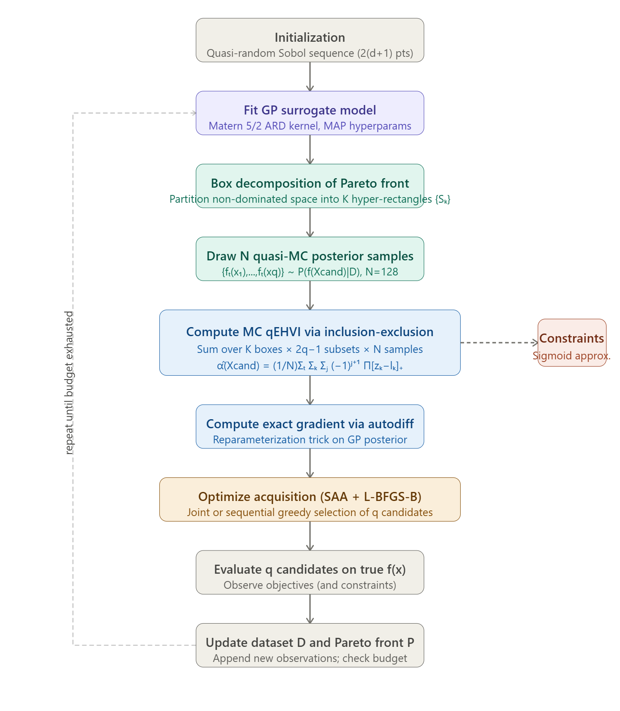

I'll read the paper and provide a comprehensive summary of the qEHVI algorithm with a pipeline figure.Here is a comprehensive summary of the **qEHVI** (q-Expected Hypervolume Improvement) algorithm, the primary multi-objective Bayesian optimization (MOBO) method introduced in this paper.

---

## Summary: qEHVI — Differentiable q-Expected Hypervolume Improvement

### 1. Problem Setting

*(Section 1, Introduction)* The paper addresses the problem of optimizing a vector-valued objective f(x): ℝ^d → ℝ^M consisting of M expensive-to-evaluate black-box functions simultaneously, with the goal of identifying the **Pareto optimal set** — solutions where no objective can be improved without degrading another. The key challenge is doing so in a **parallel** (batch) and **constrained** setting, while remaining **sample-efficient**.

---

### 2. Background: Bayesian Optimization and EHVI

*(Section 1.1)* Bayesian Optimization (BO) employs a **Gaussian Process (GP)** surrogate model to maintain a posterior distribution P(f|D) over function values given observed data D = {(xᵢ, yᵢ)}. An **acquisition function** α uses this surrogate to score candidate points, which are then evaluated on the true function. The Expected Hypervolume Improvement (EHVI) measures the expected increase in the dominated hypervolume — a metric known to produce Pareto fronts with excellent coverage — but has historically suffered from high computational cost and a lack of analytic gradients for q > 1.

---

### 3. Core Methodology

#### 3.1 Hypervolume Improvement via Box Decomposition

*(Section 3.1)* The non-dominated space is partitioned into K disjoint axis-parallel hyper-rectangles {Sₖ}. Each box Sₖ is defined by lower vertex lₖ and upper vertex uₖ. The HVI of a single new point f(x) within box Sₖ is:

$$\text{HVI}_k(f(x), l_k, u_k) = \prod_{m=1}^{M}\left[z_k^{(m)} - l_k^{(m)}\right]_+$$

where $z_k^{(m)} = \min(u_k^{(m)}, f^{(m)}(x))$ and $[\cdot]_+$ denotes $\min(\cdot, 0)$. Summing over all K boxes:

$$\text{HVI}(f(x)) = \sum_{k=1}^{K} \prod_{m=1}^{M}\left[z_k^{(m)} - l_k^{(m)}\right]_+$$

#### 3.2 q-HVI via the Inclusion-Exclusion Principle

*(Section 3.2)* For q > 1 parallel candidates {f(xᵢ)}ᵢ₌₁^q, the joint HVI is computed using the **inclusion-exclusion principle**. Define Aᵢ = Δ({f(xᵢ)}, P, r) as the space dominated by f(xᵢ) but not by the existing Pareto set P. Then:

$$\text{HVI}(\{f(x_i)\}_{i=1}^q) = \sum_{k=1}^{K}\sum_{j=1}^{q}\sum_{X_j \in \mathcal{X}_j}(-1)^{j+1}\prod_{m=1}^{M}\left[z_{k,X_j}^{(m)} - l_k^{(m)}\right]_+$$

where $\mathcal{X}_j$ is the set of all subsets of candidates of size j, and $z_{k,X_j}^{(m)} = \min\left(u_k^{(m)}, \min_{x' \in X_j} f^{(m)}(x')\right)$. This formulation avoids Pareto-front computation per sample and is fully parallelizable.

#### 3.3 Monte Carlo Estimation of qEHVI

*(Section 3.3)* Since the true objective values are unknown, qEHVI is computed as a **Monte Carlo expectation** over the GP joint posterior:

$$\hat{\alpha}^N_{q\text{EHVI}}(X_\text{cand}) = \frac{1}{N}\sum_{t=1}^{N}\sum_{k=1}^{K}\sum_{j=1}^{q}\sum_{X_j \in \mathcal{X}_j}(-1)^{j+1}\prod_{m=1}^{M}\left[z_{k,X_j,t}^{(m)} - l_k^{(m)}\right]_+$$

where {fₜ(xᵢ)} are samples from the joint posterior P(f(x₁),...,f(xq)|D), and the MC error scales as 1/√N. In practice, **randomized quasi-Monte Carlo** (QMC) methods are used to reduce variance. The single-threaded time complexity is T₁ = O(MNK(2^q − 1)), but the critical path is T∞ = O(1), enabling near-constant wall time on GPU hardware.

#### 3.4 Outcome Constraints

*(Section 3.4 and Appendix A.3)* For V auxiliary black-box constraints c^(v)(x) ≥ 0, the constrained HVI is:

$$\text{HVI}_C(f(x), c(x)) = \text{HVI}[f(x)] \cdot \mathbf{1}[c(x) \geq 0]$$

In the MC formulation, the indicator is approximated by a **sigmoid function** for differentiability:

$$\mathbf{1}[c^{(v)}(x') \geq 0] \approx s(c^{(v)}(x'); \epsilon) = \frac{1}{1 + \exp(-c^{(v)}(x')/\epsilon)}$$

which becomes exact as ε → 0. This integrates seamlessly into the inclusion-exclusion HVI formula by treating constraint indicators as additional product factors per subset Xⱼ.

---

### 4. Gradient Computation and Optimization

*(Section 4.1–4.2)* A key contribution is computing **exact gradients** of the MC estimator via **auto-differentiation** and the **reparameterization trick**. Posterior samples are written as fₜ(x) = μ(x) + L(x)εₜ, where L(x) is the Cholesky factor of the posterior covariance, enabling gradient flow through x. Using the **Sample Average Approximation (SAA)** framework, the fixed-sample objective is maximized with deterministic quasi-second-order optimizers (L-BFGS-B). Under mild regularity conditions on the GP mean and covariance, the paper proves almost-sure convergence of the SAA optimizer to the true acquisition function optimum (Theorem 2).

---

### 5. Sequential Greedy and Joint Batch Optimization

*(Section 4.3)* Two strategies are supported for selecting q candidates: (1) **joint optimization** of all q candidates simultaneously in a qd-dimensional space, and (2) **sequential greedy optimization**, which selects one candidate at a time while integrating over the posterior of previously selected pending points. The sequential greedy approach benefits from a (1 − 1/e) suboptimality bound (leveraging submodularity of HVI). Unlike prior work, qEHVI performs proper posterior integration at pending points — not imputation by the posterior mean — via the inclusion-exclusion formulation applied to pending and new candidates jointly.

---

### 6. Pipeline Diagram---

### 7. Empirical Results

*(Section 5)* qEHVI was evaluated on four benchmarks: Branin-Currin (M=2), C2-DTLZ2 (M=2, constrained), VEHICLESAFETY (M=3), and ABR policy optimization (M=3). It outperforms all baselines — SMS-EGO, PESMO, TS-TCH, ParEGO, and analytic EHVI — in terms of log hypervolume difference across all problems. Critically, its wall time is an order of magnitude lower than PESMO on CPU, and its sample complexity does not degrade substantially with increasing batch size q, unlike competing methods.

---

### 8. Limitations

*(Section 6)* The method currently assumes **noiseless observations**, a limitation shared by all EHVI formulations. Scalability to high-dimensional objective spaces (M ≥ 4) is constrained by the cost of exact box decomposition, though approximate partitioning algorithms (e.g., Couckuyt et al.) can mitigate this at moderate accuracy loss. The memory footprint scales as O(MNK(2^q − 1)), which can be limiting on GPU for large M and q.